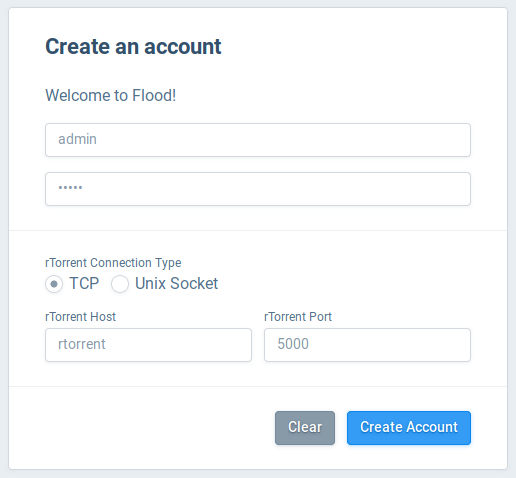

# Simple rTorrent - UNDER CONSTRUCTION!
A lightweight and simple rtorrent container.

I made this because I wanted a simple rtorrent container without any WebUI. The idea is to run the WebUI in a seperate container. There's no authentication, because the container is not meant to be exposed outside the docker network.  
Basically, rtorrent runs in daemon mode and lighttpd proxys the SCGI port 5000 to `http://<ip>/RPC2`. You can also expose the SCGI port directly for fx. [Flood-UI](https://github.com/Flood-UI/flood) to connect to.

In the `assets` folder you vil find the configuration necessary for this container.
```
assets
├── init.sh
├── lighttpd.conf
├── rtorrent.rc
├── rtorrent-supervisord.ini
├── start-lighttpd.sh
└── start-rtorrent.sh
```

When the container starts, it will start the `supervisord` which til load the services in the `rtorrent-supervisord.ini`. The services are as follows.
 - `init` -> Runs `init.sh`
 - `rtorrent` -> Runs `start-rtorrent.sh`
 - `lighttpd` -> Runs `start-lighttpd.sh`

The `init` service will start when the container starts, and it will start the two other services. If you want the container to do anything *before* rtorrent and lighttpd starts, the `init.sh` script is where you do it.

`lighttpd.conf` is just a default config file with below lines added to it. Nothing more, nothing less.
```
server.modules += ( "mod_scgi" )
scgi.server = ( "/RPC2" =>
    ( "127.0.0.1" =>
        (
            "host" => "127.0.0.1",
            "port" => 5000,
            "check-local" => "disable"
        )
    )
)
```

And finally, the `rtorrent.rc` file. We all know what that does.

## Example
In this example I will be running rtorrent with [Flood-UI](https://github.com/Flood-UI/flood)

Firstly, Flood-UI does not have an update docker image so we must build one our self.
```
$ git clone https://github.com/Flood-UI/flood.git
$ cd flood
$ docker build -t flood-ui .
```

Then run below Docker Compose file.
```
version: '3.7'

networks:
  default:
    name: rtorrent

services:
  rtorrent:
    image: kerwood/simple-rtorrent:0.9.8
    container_name: rtorrent
    expose:
      - "80"
      - "5000"
    ports:
      - 51001:51001
    volumes:
      - /home/downloads:/downloads
      - /home/watch:/watch
    environment:
      - UID=999
      - GID=999
      - ENABLE_SCGI=true #Enable if you need an HTTP /RPC2 endpoint.
  flood:
    image: flood-ui
    container_name: flood-ui
    ports:
      - 3000:3000
    volumes:
      - /home/flood-db:/data
```

Go to `http://<IP>:3000` and setup the connection as showed below. `rTorrent Host` is the name of the service in the docker file. In this case `rtorrent`.


Flood-UI does have two environment variables as below, but on this day of writing, it does not really change anything. You still have to write the rTorrent host and port input field.
```
environment:
  - RTORRENT_SCGI_HOST=rtorrent
  - RTORRENT_SCGI_PORT=5000
```